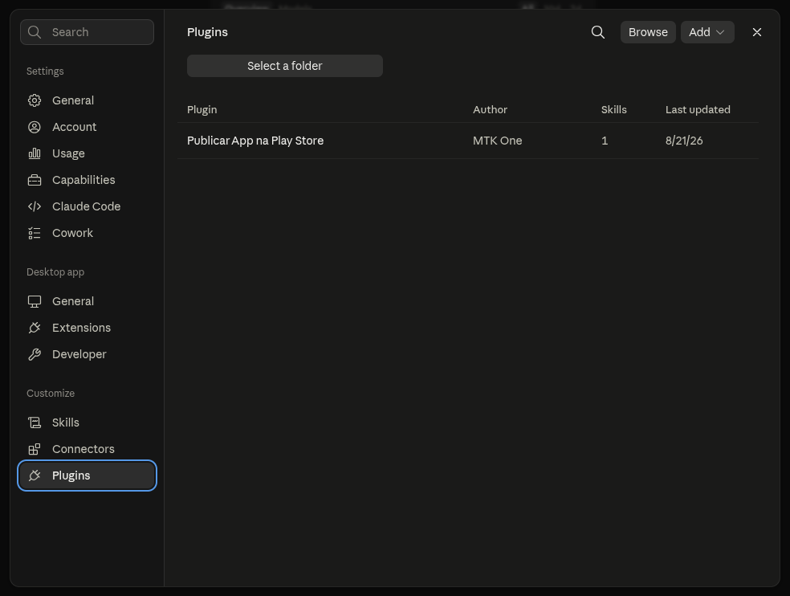
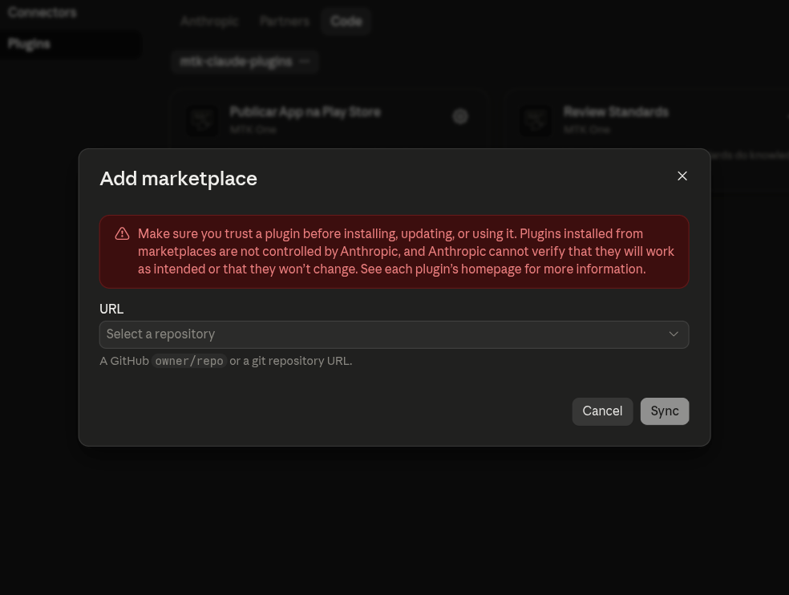
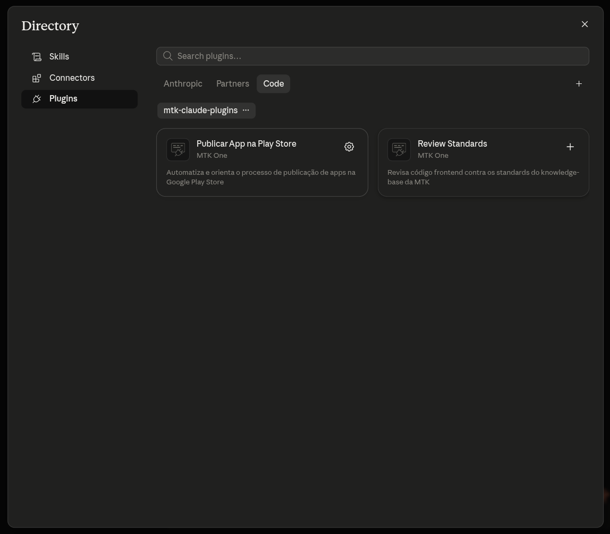
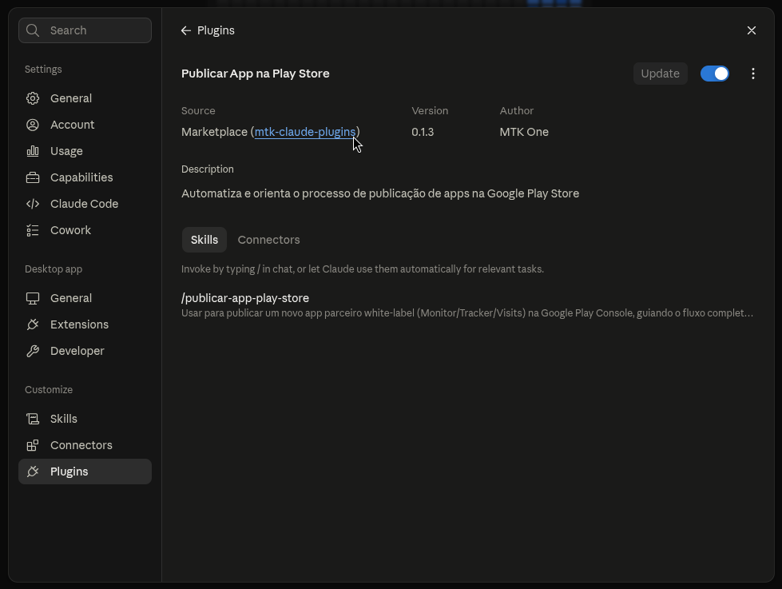
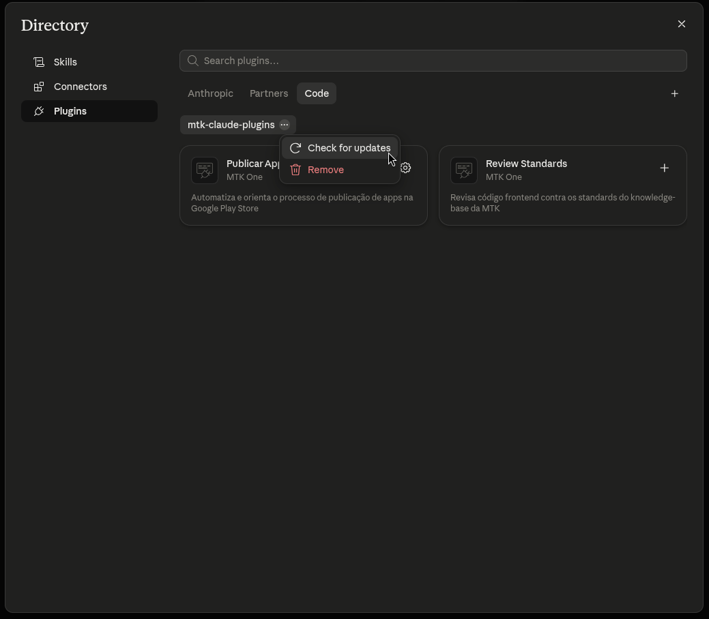
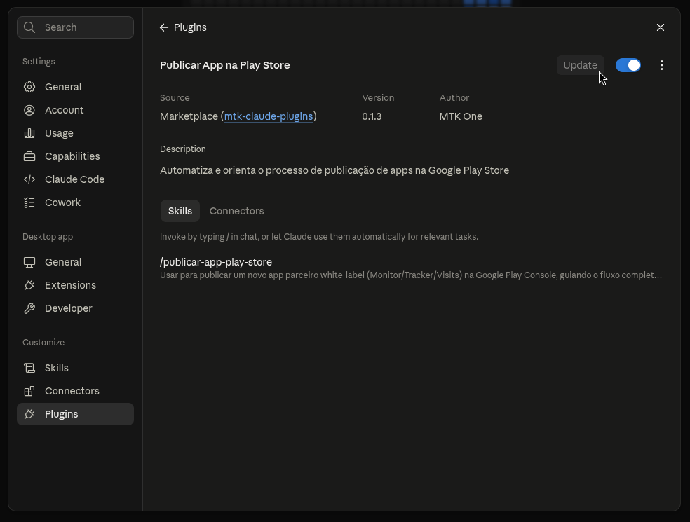

# mtk-claude-plugins

Repositório de **plugins do Claude Code** da MTK. Funciona como um _marketplace_: qualquer pessoa pode adicionar este repositório no Claude Code e instalar os plugins/skills daqui.

## Conceitos

### Plugin

Um **plugin** é um pacote autocontido que estende o Claude Code com funcionalidades: skills, MCP servers, agents, hooks, etc. Cada plugin vive em sua própria pasta, com um manifesto `.claude-plugin/plugin.json` descrevendo nome, versão, descrição e autor.

### Marketplace

Um **marketplace** é um catálogo (`marketplace.json`) que lista os plugins disponíveis e onde encontrá-los. Este repositório é um marketplace: o arquivo `.claude-plugin/marketplace.json` na raiz lista todos os plugins publicados aqui.

### Skill

Uma **skill** é uma instrução reutilizável que o Claude aprende a executar. É definida em um arquivo `SKILL.md` com um frontmatter YAML (pelo menos o campo `description`, que diz ao Claude quando invocá-la automaticamente) seguido do corpo em markdown com as instruções. Skills ficam em `<plugin>/skills/<nome-da-skill>/SKILL.md` e são descobertas automaticamente quando o plugin é instalado. Depois de instalada, uma skill pode ser chamada explicitamente como `/nome-do-plugin:nome-da-skill`.

### Tools

**Tools** são as capacidades que o Claude usa para agir (ler/editar arquivos, rodar comandos, chamar uma API, etc.). Um plugin pode trazer tools próprias via MCP servers, além das tools nativas do Claude Code.

### MCP (Model Context Protocol)

**MCP** é o protocolo usado para conectar o Claude a serviços/ferramentas externas (APIs, bancos de dados, etc.), expondo novas tools. Um plugin registra seus MCP servers em um arquivo `.mcp.json` na raiz do plugin (chave `mcpServers`). Ao instalar/habilitar o plugin, o Claude Code inicia esses servidores automaticamente.

## Estrutura do repositório

```
mtk-claude-plugins/
├── .claude-plugin/
│   └── marketplace.json              # catálogo do marketplace: lista todos os plugins publicados aqui
├── nome-do-plugin/                   # pasta de um plugin (uma por plugin, na raiz do repo)
│   ├── .claude-plugin/
│   │   └── plugin.json               # obrigatório: manifesto do plugin (nome, versão, descrição, autor)
│   ├── .mcp.json                     # opcional: MCP servers que o plugin registra (chave "mcpServers")
│   └── skills/
│       └── nome-da-skill/
│           └── SKILL.md              # uma pasta por skill; pode haver várias skills num mesmo plugin
└── README.md
```

Para criar um novo plugin:

1, Criar a pasta `nome-do-plugin/` na raiz com `.claude-plugin/plugin.json` (obrigatório).
2, Adicionar `.mcp.json` na raiz do plugin, se ele precisar expor MCP servers.
3, Adicionar uma pasta em `skills/<nome-da-skill>/SKILL.md` para cada skill do plugin.
4, Registrar o plugin na lista `plugins` de `.claude-plugin/marketplace.json`.

## Instalar um plugin

Dentro de uma sessão do Claude Code rode o comando:

```
/plugin install publicar-app-play-store@mtk-claude-plugins
```

O comando de instalação abre um menu para escolher o escopo (`user`, `project` ou `local`).

### No Claude Desktop

1. Abra as configurações (`Ctrl+,`) e vá em **Plugins**.

   

2. Clique em **Browse**, vá na aba **Code** e clique no `+` ao lado das abas para adicionar um marketplace.
3. Cole a URL do repositório (`https://github.com/mobiltracker/mtk-claude-plugins.git`) e clique em **Sync**.
   
4. De volta à aba **Code**, selecione `mtk-claude-plugins` e clique no `+` de cada plugin que quiser instalar.
   

### Publicando alterações

O Claude Code **não** detecta automaticamente novos commits. Antes de commitar/dar push em qualquer alteração de conteúdo (skill, `plugin.json`, etc.) de um plugin já publicado no marketplace, dê bump no campo `version`:

- No `plugin.json` do plugin **e** no `marketplace.json`.
- O Claude Code decide se há atualização comparando esse número — não o conteúdo dos arquivos.
- Sem o bump, nem `/plugin marketplace update` nem `/reload-plugins` puxam o conteúdo novo (o cache em `~/.claude/plugins/cache/.../<version>/` só é regravado quando a versão muda).

1. Commitar as mudanças:
   ```bash
   git add <arquivos>
   git commit -m "mensagem do commit"
   ```
2. Dar push:
   ```bash
   git push -u origin master
   ```

## Puxar alterações

Quem já tem o marketplace adicionado no Claude Code precisa atualizar cada plugin já instalado:

```
/plugin update <nome do plugin>@mtk-claude-plugins
```

> `/reload-plugins` sozinho só resolve para plugins instalados em modo local/dev (linkados direto da pasta do repo).

> Dica: com _auto-update_ habilitado (aba **Marketplaces** em `/plugin`), o catálogo se atualiza sozinho em segundo plano.

### No Claude Desktop

1. Settings (`Ctrl+,`) → **Plugins** → clique no plugin para abrir os detalhes.
   
2. Clique em **Browse**, vá na aba **Code** e clique nos `...` ao lado de `mtk-claude-plugins` → **Check for updates**.
   
3. Volte aos detalhes do plugin: se houver atualização, o botão **Update** fica habilitado — clique para atualizar.
   

## Comandos úteis

| Comando                                             | O que faz                                                                         |
| --------------------------------------------------- | --------------------------------------------------------------------------------- |
| `/plugin`                                           | Abre o gerenciador de plugins (Discover, Installed, Marketplaces, Errors)         |
| `/plugin marketplace add <fonte>`                   | Adiciona este repositório como marketplace                                        |
| `/plugin marketplace update <nome>`                 | Atualiza o catálogo do marketplace (busca novos plugins/versões)                  |
| `/plugin marketplace list`                          | Lista os marketplaces adicionados                                                 |
| `/plugin marketplace remove <nome>`                 | Remove um marketplace                                                             |
| `/plugin install <plugin>@<marketplace>`            | Instala um plugin                                                                 |
| `/plugin update <plugin>@<marketplace>`             | Atualiza um plugin já instalado para a versão mais recente do catálogo            |
| `/plugin list`                                      | Lista plugins instalados                                                          |
| `/plugin enable` / `disable <plugin>@<marketplace>` | Habilita/desabilita um plugin sem desinstalar                                     |
| `/plugin uninstall <plugin>@<marketplace>`          | Remove um plugin                                                                  |
| `/plugin details <plugin>@<marketplace>`            | Mostra o que o plugin traz (skills, agents, hooks, MCP servers)                   |
| `/reload-plugins`                                   | Recarrega plugins/skills/hooks/MCP servers sem reiniciar a sessão                 |
| `/skills`                                           | Lista as skills disponíveis (nativas, do projeto, de plugins) e permite favoritar |
| `/mcp`                                              | Lista os MCP servers configurados, status de conexão e permite autenticar         |

Equivalentes via CLI: `claude plugin marketplace add|list|update|remove`, `claude plugin install|update|uninstall|enable|disable|list|details`.
